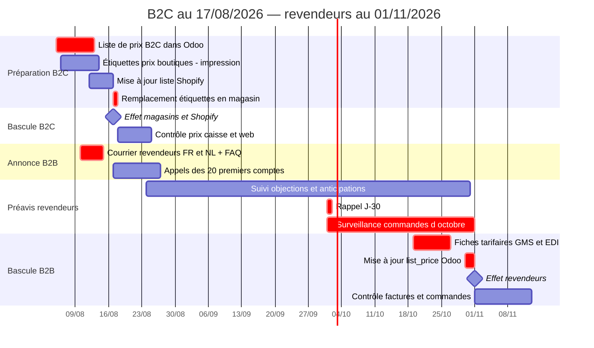

# Hausse tarifaire Teatower 2026

*Établi le 30/07/2026 sur les ventes réelles Odoo, 12 mois glissants du 30/07/2025 au 30/07/2026. Exercice social : 1er juillet → 30 juin.*
*Révisé le 04/08/2026 — marches ramenées à +0,50 € sur les doypacks et les infusions, et à 10,50 € sur les thés glacés ; calendrier découplé B2C 17/08 et revendeurs 01/11. Le scénario du 30/07 reste affiché en regard pour la comparaison.*

## Synthèse

| | Montant |
|---|---:|
| Base concernée, 12 mois réels | 164 394 u — 1 302 274 € HT |
| **Gain annuel en régime de croisière** | **+82 823 €** |
| dont revendeurs (GMS, B2B, Horeca) | +54 596 € |
| dont direct (boutiques, Shopify) | +28 227 € |
| Effet sur la marge brute | +8,8 % |
| Gain sur FY26-27 selon calendrier décidé | +63 473 € |
| Perte de volume tolérable avant destruction de marge | −8,1 % |

La hausse ne coûte rien à produire : les 82 823 € tombent intégralement en marge brute.

**Calendrier décidé :** le B2C — magasins et Shopify — bascule le **17/08/2026** ; les revendeurs conservent l'ancien tarif jusqu'au **31/10/2026** et basculent au **01/11/2026**. Décision associée : passage à **deux révisions tarifaires par an** au lieu d'un rattrapage pluriannuel.

## 1. Périmètre

| Gamme | Ancien | Nouveau | Hausse | SKU concernés |
|---|---|---|---:|---:|
| Doypacks vrac `V0` | 10,00 € TTC | 10,50 € TTC | +5,0 % | 99 |
| Sinfus / infusettes `I0` | 11,00 € TTC | 11,50 € TTC | +4,5 % | 90 |
| Horeca 25 env. `HC250` | 10,00 € HT | 11,00 € HT | +10,0 % | 28 |
| Thés glacés `GI0` | 9,50 € TTC | 10,50 € TTC | +10,5 % | 7 |

Les prix Odoo sont stockés **hors TVA** : à 6 %, l'échelle 9,43 / 9,91 / 10,38 / 10,85 € HT correspond à 10,00 / 10,50 / 11,00 / 11,50 € TTC. Seul l'Horeca est annoncé en HT. Le chiffrage ne retient que les SKU réellement au prix de référence.

Le dossier est désormais homogène : trois marches sur quatre sont comprises entre 4,5 et 10,5 %, là où la version du 30 juillet demandait +26 % sur les thés glacés. C'est une **indexation**, plus un repositionnement — et cela change l'argumentaire face aux acheteurs.

À nettoyer avant toute manipulation de prix : les 9 références `GI0` à 8,50 € sont mortes (130 unités en 2025, zéro en 2026) et doivent être archivées, et `GI0917` est un doublon corrompu de `GI0916`. Les `standard_price` sont par ailleurs absents ou factices sur environ 40 % des volumes de thés glacés — les marges de cette gamme utilisent ici un coût de référence de 2,15 €.

## 2. Ce qu'on gagne aujourd'hui

| Gamme | Volumes | CA HT | Prix net moyen | Marge brute | Marge % |
|---|---:|---:|---:|---:|---:|
| Doypacks vrac `V0` | 49 419 | 411 150 | 8,32 | 309 758 | 75 % |
| Sinfus / infusettes `I0` | 62 579 | 506 689 | 8,10 | 397 113 | 78 % |
| Horeca 25 env. `HC250` | 30 021 | 234 171 | 7,80 | 135 363 | 58 % |
| Thés glacés `GI0` | 22 375 | 150 263 | 6,72 | 102 157 | 68 % |
| **Total** | **164 394** | **1 302 274** | **7,92** | **944 391** | **73 %** |

| Canal | CA HT | Gain annuel | Part du gain | *Pour mémoire, version 30/07* |
|---|---:|---:|---:|---:|
| B2B revendeurs | 381 151 | +28 132 | 34 % | *+41 427* |
| Boutiques TT | 409 982 | +21 768 | 26 % | *+45 325* |
| GMS | 314 414 | +19 174 | 23 % | *+42 367* |
| Horeca | 75 154 | +7 289 | 9 % | *+7 513* |
| Shopify | 119 982 | +6 317 | 8 % | *+13 161* |
| Salon / pop-up | 1 488 | +134 | 0 % | *+325* |
| Amazon | 102 | +8 | 0 % | *+18* |

Le B2B passe premier contributeur du gain, devant les boutiques : c'est mécanique, l'Horeca `HC250` est la seule gamme qui garde sa marche pleine à +1 € et elle est vendue par les revendeurs. Le prix net réalisé en GMS et en B2B tourne autour de 65 à 70 % du tarif : ce sont les conditions revendeurs, et c'est sur ce prix net que l'uplift est calculé — les remises et les promos Buy-X-Get-Y sont donc déjà intégrées.

## 3. Ce que rapporte la hausse

| Gamme | CA HT actuel | CA HT après | Gain annuel | *Version 30/07* |
|---|---:|---:|---:|---:|
| Doypacks vrac `V0` | 411 150 | 431 708 | **+20 558** | *+41 115* |
| Sinfus / infusettes `I0` | 506 689 | 529 720 | **+23 031** | *+46 063* |
| Horeca 25 env. `HC250` | 234 171 | 257 588 | **+23 417** | *+23 417* |
| Thés glacés `GI0` | 150 263 | 166 080 | **+15 817** | *+39 543* |
| **Total** | **1 302 274** | **1 385 097** | **+82 823** | *+150 138* |

Hypothèse : grille indexée du même pourcentage sur tous les canaux, volumes constants. Aucun coût supplémentaire, donc **+82 823 € de marge brute**, soit +8,8 % sur la marge actuelle de ces gammes.

**Ce que coûte la modération : 67 315 € par an.** C'est le prix explicite d'un dossier moins risqué — et il se lit surtout sur les thés glacés (−23 726 €) et les doypacks (−20 558 €).

## 4. Si les revendeurs refusent

| Scénario | Gain annuel |
|---|---:|
| Répercussion intégrale, tous canaux | **+82 823** |
| Revendeurs seuls — prix consommateur gelé | +54 596 |
| Direct seul — boutiques et Shopify | +28 227 |

Les revendeurs pèsent 66 % du gain — davantage qu'en version 30/07, où ils n'en faisaient que 61 %. Le dossier dépend donc **plus** de la négociation revendeurs qu'avant, alors même que la marche qu'on leur demande est plus faible. C'est cohérent : la seule marche restée à +1 € est celle de l'Horeca.

## 5. Et si on perd du volume

| Perte de volume | Variation de marge brute |
|---:|---:|
| 0 % | +82 823 |
| −5 % | +31 462 |
| −10 % | −19 898 |
| −15 % | −71 259 |

Point mort global à **−8,1 %** de volume, contre −13,7 % en version 30/07 : la marge de sécurité se réduit à mesure que la marche se réduit, c'est arithmétique.

| Gamme | Point mort volume | *Version 30/07* |
|---|---:|---:|
| Doypacks vrac `V0` | −6,2 % | *−11,7 %* |
| Sinfus / infusettes `I0` | −5,5 % | *−10,4 %* |
| Horeca 25 env. `HC250` | −14,8 % | *−14,8 %* |
| Thés glacés `GI0` | −13,4 % | *−27,9 %* |

Le point mort des Sinfus, à −5,5 %, est le plus tendu du dossier : perdre une unité sur vingt suffit à annuler le gain. À ce niveau de marche, la hausse doit se faire **sans concession commerciale compensatoire** — une remise de rattrapage de 2 % sur un gros compte consomme près de la moitié du gain qu'il rapporte.

En contrepartie, la réserve du 30 juillet sur les thés glacés tombe : à 10,50 €, le thé glacé se retrouve **exactement au même prix** que le doypack vrac, et non plus 1 € au-dessus. La question du grammage (50 g renseigné contre 80 à 100 g pour un doypack) reste ouverte, mais elle n'est plus bloquante : on ne demande plus à un acheteur d'accepter un thé glacé plus cher qu'un doypack qui contient deux fois plus de thé.

## 6. Le calendrier vaut de l'argent

| Poids du CA par mois | Jan | Fév | Mar | Avr | Mai | Juin | Juil | Août | Sep | Oct | Nov | Déc |
|---|---|---|---|---|---|---|---|---|---|---|---|---|
| 3 gammes d'hiver | 12 % | 10 % | 11 % | 9 % | 9 % | 8 % | 6 % | 3 % | 5 % | 9 % | 9 % | 10 % |
| Thés glacés | 1 % | 2 % | 3 % | 7 % | 16 % | 34 % | 24 % | 6 % | 4 % | 1 % | 1 % | 1 % |

Les saisonnalités sont **opposées**. Les trois gammes d'hiver font 60 % de leur CA d'octobre à mars, avec un pic en janvier ; les thés glacés font 87 % du leur d'avril à août, avec un pic en juin.

| Entrée en vigueur | Gain FY26-27 | Part du régime plein |
|---|---:|---:|
| **Décidé — B2C au 17/08/2026, revendeurs au 01/11/2026** | **+63 473** | 77 % |
| Tout au 01/11/2026 | +61 624 | 74 % |
| Tout au 01/12/2026 | +55 309 | 67 % |
| 3 gammes au 01/12/2026 + `GI0` au 01/03/2027 | +54 782 | 66 % |

**Découpler le B2C du B2B rapporte 8 691 € de plus sur l'exercice** qu'un calendrier unique. Les magasins et Shopify n'ont pas besoin de préavis : trois mois et demi de vente au nouveau tarif sont pris avant même que le B2B ne bascule, et ils tombent dans le creux estival où le renoncement coûte le moins cher.

Sur les thés glacés, la bascule au 17 août est également la meilleure des trois dates testées : la saison courant d'avril à août, l'exercice FY26-27 contient toute la saison 2027 quelle que soit la date, mais le 17 août capte en plus la fin de la saison 2026. Soit **+11 607 €** contre +9 601 € au 01/03/2027.

| Canal | Date d'effet | Gain FY26-27 | Régime plein |
|---|---|---:|---:|
| Boutiques Teatower | 17/08/2026 | +19 389 | +21 902 |
| B2B revendeurs | 01/11/2026 | +19 211 | +28 132 |
| GMS | 01/11/2026 | +13 746 | +19 174 |
| Shopify | 17/08/2026 | +5 777 | +6 317 |
| Horeca | 01/11/2026 | +5 343 | +7 289 |

Le B2C capte 89 % de son potentiel annuel dès le premier exercice, les revendeurs 70 %. C'est le prix d'une transition négociée.

**Le préavis a un coût chiffrable.** Les revendeurs peuvent commander à l'ancien tarif jusqu'au 31 octobre tout en revendant au nouveau prix : un mois de volume avancé représente **4 550 €** d'uplift perdu, et **6 851 €** si novembre et décembre sont achetés en octobre. Plafonner les commandes d'octobre au volume moyen des trois mois précédents est le seul garde-fou — et il doit figurer dans le courrier B2B, pas après.

## 7. Option : indexer toute la gamme

Le chiffrage ci-dessus ne porte que sur les SKU au prix de référence. Indexer aussi les autres formats et séries limitées des gammes `V0`, `I0` et `HC250` rapporterait **+9 446 € de plus par an** (contre +18 892 € en version 30/07). À trancher : ces références ont déjà des prix non ronds, une indexation les rendrait encore moins lisibles en rayon.

## 8. Plan de déploiement

Responsables : **Nicolas** pour les grilles, l'audit contractuel et la bascule système ; **Stephan** pour la liste Shopify et le courrier d'annonce ; **Jérôme** pour la FAQ et les appels grands comptes ; **Vanessa** pour le contrôle des prix sur les commandes et factures ; **Stéphanie, Aurélie, Emeline et Sybille** pour l'impression et le remplacement des étiquettes en boutique le 17 août en fin de journée.

Quatre pièges de bascule :

1. **Les magasins et le B2B partagent la même liste de prix dans Odoo.** La liste « Par défaut » ne contient aucune règle : elle renvoie le `list_price` de la fiche produit, et c'est celle des six caisses *comme* de tous les clients B2B, GMS et Horeca. Modifier le `list_price` le 17 août ferait donc monter les prix revendeurs le 17 août aussi. Il faut créer une **liste B2C temporaire** pour les caisses et ne toucher au `list_price` qu'au 1er novembre.
2. **Shopify est en `taxes_included`** : pousser **10,50 et 11,50 TTC**, jamais le HT. La liste « Odoo x Shopify » contient 542 prix fixes — c'est bien elle qu'il faut mettre à jour en place, pas une nouvelle.
3. Les **fiches tarifaires GMS** partent avant la bascule Odoo sous peine de rejet EDI — date pivot désormais le 1er novembre.
4. Les **promos B2C** restent en Buy-X-Get-Y, jamais en pourcentage.
