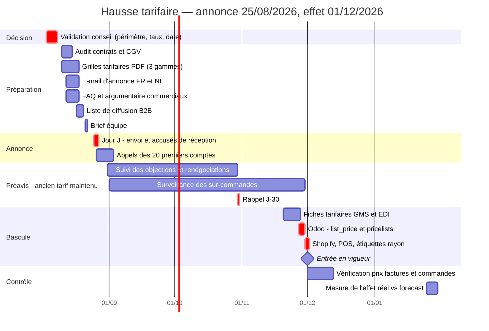

# Hausse tarifaire Teatower 2026 — plan de déploiement et forecast 12 mois

*Document de direction, confidentiel. Établi le 30/07/2026 à partir des ventes réelles Odoo.*

---

## Synthèse pour le conseil

Trois gammes sont concernées : les doypacks vrac (10 → 11 € TTC), les Sinfus / infusettes
(11 → 12 € TTC) et la boîte Horeca de 25 enveloppes (10 → 11 € HTVA). Ensemble, elles
pèsent **1 152 010 € de CA HT** et **842 234 € de marge brute** sur les douze derniers mois,
soit environ deux tiers de l'activité.

| | Montant |
|---|---:|
| Gain annuel en régime de croisière | **+110 595 €** |
| dont canaux revendeurs (GMS, B2B, Horeca) | +63 713 € |
| dont canaux directs (boutiques, Shopify) | +46 882 € |
| Effet sur la marge brute des 3 gammes | **+13,1 %** |
| Gain sur FY26-27, annonce fin août, effet 01/12/2026 | +74 927 € |
| Perte de volume tolérable avant destruction de marge | **−11,6 %** |

**La hausse ne coûte rien à produire : les 110 595 € tombent intégralement en marge
brute.** Même produit, même coût d'achat, aucune charge nouvelle. À titre de comparaison,
les leviers d'embellissement du P&L identifiés en juin avaient rapporté 28 063 € au total,
pour un travail bien plus lourd.

**La question n'est pas *si*, mais *quand*.** La saison haute de ces gammes court
d'octobre à mars ; le creux, c'est juillet-août-septembre. Un préavis de trois mois
annoncé maintenant se consomme donc entièrement dans le creux, et le nouveau tarif
s'applique pile au démarrage de la saison forte. Chaque mois de report se paie ensuite sur
un gros mois : **21 573 €** séparent l'annonce la plus précoce de l'annonce décalée de
deux mois.

### Recommandation

| | |
|---|---|
| **Annonce** | mardi **25/08/2026**, au retour des congés |
| **Entrée en vigueur** | **01/12/2026**, soit trois mois et six jours de préavis |
| **Périmètre** | cœur de gamme : les 217 SKU aujourd'hui à 10 ou 11 € |
| **Répercussion** | intégrale, tous canaux, grille indexée du même pourcentage |
| **Gain FY26-27** | **+74 927 €**, puis +110 595 € par exercice plein dès FY27-28 |

Un quatrième volet a été ajouté au dossier à la demande de Nicolas : le passage des
thés glacés `GI0` de 9,50 à 12 € TTC, qui vaut **+39 543 €/an** de plus mais relève d'un
repositionnement de +26 % et non d'une indexation — traité au point 12.

Deux arbitrages restent à trancher par le conseil, tous deux documentés plus bas :
faut-il indexer aussi les SKU hors prix de référence (**+18 892 €**),
et faut-il plafonner les commandes d'anticipation pendant le préavis.

---

# Partie A — Forecast

Base : ventes réelles sur les **12 mois glissants du 30/07/2025 au 30/07/2026** (lignes de commande client aux états `sale`/`done` + lignes de caisse `paid`/`done`/`invoiced`, hors transferts internes boutiques et hors échantillons marketing).

Exercice social Teatower : **1er juillet → 30 juin**. Nous sommes au mois 2 de FY26-27.

## 1. Périmètre : quels SKU sont concernés

| Gamme | Préfixe | SKU au prix de référence | Autres SKU de la gamme | Ancien | Nouveau | Hausse |
|---|---|---:|---:|---|---|---:|
| Doypacks vrac (V0) | `V0*` | 99 | 109 | 10,00 € TTC | 11,00 € TTC | +10,0 % |
| Sinfus / infusettes (I0) | `I0*` | 90 | 60 | 11,00 € TTC | 12,00 € TTC | +9,1 % |
| Horeca boîte 25 env. (HC250) | `HC250*` | 28 | 1 | 10,00 € HT | 11,00 € HT | +10,0 % |

Le prix est stocké **hors TVA** dans Odoo : à 6 % de TVA, l'échelle 9,43 / 10,38 / 11,32 € HT correspond à 10 / 11 / 12 € TTC. Le chiffrage porte sur le **cœur de gamme**, c'est-à-dire les SKU aujourd'hui positionnés au prix de référence. Les autres SKU de ces gammes (autres formats, séries limitées, bio premium) sont chiffrés séparément au point 7.

## 2. Ce qu'on gagne aujourd'hui

### Doypacks vrac (V0)

| Canal | Volumes (u) | CA HT | Prix net moyen | Coût unitaire | Marge brute | Marge % |
|---|---:|---:|---:|---:|---:|---:|
| Boutiques TT (caisse) | 26 184 | 236 975 | 9,05 | 2,11 | 181 760 | 77 % |
| B2B revendeurs | 9 917 | 68 344 | 6,89 | 2,04 | 48 105 | 70 % |
| Shopify (B2C web) | 6 159 | 58 245 | 9,46 | 2,12 | 45 217 | 78 % |
| GMS | 6 948 | 46 149 | 6,64 | 1,82 | 33 529 | 73 % |
| Horeca | 195 | 1 285 | 6,59 | 1,47 | 999 | 78 % |
| Salon / pop-up | 14 | 132 | 9,43 | 0,00 | 132 | 100 % |
| Amazon | 2 | 20 | 10,16 | 2,05 | 16 | 80 % |
| **Total** | **49 419** | **411 150** | **8,32** | | **309 758** | **75 %** |

### Sinfus / infusettes (I0)

| Canal | Volumes (u) | CA HT | Prix net moyen | Coût unitaire | Marge brute | Marge % |
|---|---:|---:|---:|---:|---:|---:|
| GMS | 25 974 | 190 078 | 7,32 | 1,82 | 142 735 | 75 % |
| Boutiques TT (caisse) | 13 895 | 138 623 | 9,98 | 1,71 | 114 827 | 83 % |
| B2B revendeurs | 17 329 | 122 990 | 7,10 | 1,68 | 93 805 | 76 % |
| Shopify (B2C web) | 4 944 | 51 727 | 10,46 | 1,71 | 43 296 | 84 % |
| Horeca | 409 | 2 980 | 7,29 | 1,84 | 2 227 | 75 % |
| Salon / pop-up | 25 | 259 | 10,38 | 2,45 | 198 | 76 % |
| Amazon | 3 | 31 | 10,38 | 2,09 | 25 | 80 % |
| **Total** | **62 579** | **506 689** | **8,10** | | **397 113** | **78 %** |

### Horeca boîte 25 env. (HC250)

| Canal | Volumes (u) | CA HT | Prix net moyen | Coût unitaire | Marge brute | Marge % |
|---|---:|---:|---:|---:|---:|---:|
| B2B revendeurs | 20 939 | 162 663 | 7,77 | 3,27 | 94 215 | 58 % |
| Horeca | 8 999 | 70 738 | 7,86 | 3,35 | 40 628 | 57 % |
| GMS | 69 | 630 | 9,13 | 2,99 | 424 | 67 % |
| Boutiques TT (caisse) | 14 | 140 | 9,96 | 3,05 | 97 | 69 % |
| **Total** | **30 021** | **234 171** | **7,80** | | **135 363** | **58 %** |

**Total des 3 gammes, cœur de gamme : 142 019 unités, 1 152 010 € de CA HT, 842 234 € de marge brute.**

Pour situer l'enjeu, le CA HT total de la même période toutes gammes confondues ressort autour de 1 812 430 € : ces trois gammes en représentent donc environ 64 %. *(Dénominateur brut, non retraité des doubles comptages entre commandes et caisses — à lire comme un ordre de grandeur.)*

## 3. Ce qu'on gagnerait en régime de croisière

Hypothèse centrale : **la grille est indexée du même pourcentage sur tous les canaux** — boutiques, Shopify, GMS, B2B revendeurs, Horeca. L'uplift est calculé sur le **prix net réellement réalisé**, et non sur le tarif affiché : il intègre donc déjà les remises GMS, les conditions revendeurs et l'effet dilutif des promotions Buy-X-Get-Y. Volumes supposés constants.

| Gamme | Volumes | CA HT actuel | CA HT après hausse | Gain annuel |
|---|---:|---:|---:|---:|
| Doypacks vrac (V0) | 49 419 | 411 150 | 452 265 | **+41 115** |
| Sinfus / infusettes (I0) | 62 579 | 506 689 | 552 752 | **+46 063** |
| Horeca boîte 25 env. (HC250) | 30 021 | 234 171 | 257 588 | **+23 417** |
| **Total** | **142 019** | **1 152 010** | **1 262 605** | **+110 595** |

**+110 595 € de CA HT par an, qui tombent intégralement en marge brute** : même produit, même coût d'achat, aucune charge supplémentaire. Rapporté à la marge brute actuelle de ces gammes (842 234 €), c'est **+13,1 %**.

### Répartition du gain par canal

| Canal | CA HT actuel | Gain annuel | Part du gain |
|---|---:|---:|---:|
| Boutiques TT (caisse) | 375 738 | +36 314 | 33 % |
| B2B revendeurs | 353 997 | +34 282 | 31 % |
| GMS | 236 857 | +21 958 | 20 % |
| Shopify (B2C web) | 109 972 | +10 527 | 10 % |
| Horeca | 75 003 | +7 473 | 7 % |
| Salon / pop-up | 392 | +37 | 0 % |
| Amazon | 51 | +5 | 0 % |

## 4. Scénarios de répercussion

| Scénario | Périmètre | Gain annuel |
|---|---|---:|
| A — Répercussion intégrale | Tous canaux | **+110 595** |
| B — Direct seul | Boutiques + Shopify, si les revendeurs refusent | +46 882 |
| C — Revendeurs seuls | GMS + B2B + Horeca, prix consommateur gelé | +63 713 |

Les canaux revendeurs pèsent 58 % du gain. C'est là que le préavis de 3 mois est contractuellement nécessaire, et là que se joue le risque de négociation. Même dans l'hypothèse défavorable où la GMS refuserait la hausse, le scénario B rapporte encore 46 882 € sans dépendre de personne.

## 5. Et si on perdait du volume ?

| Perte de volume | CA HT | Variation de CA | Marge brute | Variation de marge |
|---:|---:|---:|---:|---:|
| −0 % | 1 262 605 | +110 595 | 952 828 | +110 595 |
| −3 % | 1 224 727 | +72 717 | 924 244 | +82 010 |
| −5 % | 1 199 475 | +47 465 | 905 187 | +62 953 |
| −8 % | 1 161 597 | +9 586 | 876 602 | +34 368 |
| −10 % | 1 136 345 | −15 666 | 857 546 | +15 312 |
| −15 % | 1 073 214 | −78 796 | 809 904 | −32 330 |

- **Doypacks vrac (V0)** : point mort à **−11,7 %** de volume.
- **Sinfus / infusettes (I0)** : point mort à **−10,4 %** de volume.
- **Horeca boîte 25 env. (HC250)** : point mort à **−14,7 %** de volume.
- **Global sur les 3 gammes** : point mort à **−11,6 %** de volume.

Autrement dit : il faudrait perdre plus d'un dixième des volumes pour que la hausse cesse d'être rentable. La marge brute de ces gammes étant très élevée — de 57 à 84 % selon le canal —, chaque unité perdue coûte peu au regard de ce que rapporte chaque unité vendue plus cher. C'est l'argument central du dossier.

## 6. Calendrier : ce que le préavis de 3 mois coûte vraiment

### Saisonnalité du CA des 3 gammes

| Mois | Jan | Fév | Mar | Avr | Mai | Juin | Juil | Août | Sep | Oct | Nov | Déc |
|---|---|---|---|---|---|---|---|---|---|---|---|---|
| CA HT | 134 909 | 112 150 | 121 170 | 106 008 | 98 250 | 89 362 | 69 129 | 35 405 | 61 286 | 100 214 | 105 053 | 119 073 |
| Poids | 12 % | 10 % | 11 % | 9 % | 9 % | 8 % | 6 % | 3 % | 5 % | 9 % | 9 % | 10 % |

La saison haute court d'octobre à mars : 692 569 €, soit 60 % du CA annuel, avec un pic en janvier. Le creux, c'est juillet-août-septembre : 165 821 €, 14 % du CA.

### Impact sur l'exercice FY26-27 (clôture au 30/06/2027)

| Annonce | Entrée en vigueur | Mois au nouveau tarif dans FY26-27 | Gain FY26-27 | Part du régime de croisière |
|---|---|---:|---:|---:|
| 01/08/2026 (immédiate) | 01/11/2026 | 8 | **+85 048** | 77 % |
| fin 08/2026 *(recommandé)* | 01/12/2026 | 7 | **+74 927** | 68 % |
| 01/10/2026 | 01/01/2027 | 6 | **+63 475** | 57 % |
| 01/11/2026 | 01/02/2027 | 5 | **+50 589** | 46 % |

**C'est l'argument décisif du calendrier.** Annoncer maintenant fait tomber les trois mois de préavis exactement dans le creux estival : on ne renonce à la hausse que sur les trois mois les plus faibles de l'année, et le nouveau tarif s'applique dès le démarrage de la saison forte.

Chaque mois de report, à l'inverse, se paie sur un gros mois :

- annoncer fin août plutôt que début octobre : **+11 452 €** sur FY26-27 (décembre est gagné) ;
- annoncer le 1er août plutôt que fin août : +10 121 € (novembre est gagné), mais c'est matériellement intenable — la grille tarifaire, l'e-mail et la FAQ ne seront pas prêts en 48 heures, et une notification envoyée le 1er août tombe en pleines vacances, ce qui fragilise la preuve du préavis ;
- au total, **21 573 €** séparent l'annonce la plus précoce de l'annonce décalée de deux mois, pour exactement le même travail.

Régime de croisière plein, premier exercice complet FY27-28 : **+110 595 € par an**.

## 7. Option : indexer toute la gamme, pas seulement le prix de référence

| Périmètre | CA HT actuel | Gain annuel |
|---|---:|---:|
| Cœur de gamme seul *(scénario retenu)* | 1 152 010 | +110 595 |
| Toute la gamme V0 + I0 + HC250 indexée | 1 342 689 | +129 487 |
| **Écart** | +190 679 | **+18 892** |

Indexer l'ensemble des références, y compris celles hors prix de référence, rapporterait **18 892 € de plus par an**. À trancher : ces références ont déjà des prix non ronds, et une indexation les rendrait encore moins lisibles en rayon. L'arbitrage est entre 18 892 € et la clarté de la grille.

---

# Partie B — Plan de déploiement

## 8. Calendrier

## 9. Qui fait quoi

| # | Tâche | Responsable | Échéance | Livrable |
|---|---|---|---|---|
| 1 | Valider le périmètre SKU, les taux et la date d'effet | Nicolas + conseil | 07/08 | PV de décision |
| 2 | Auditer contrats et CGV : durée de préavis réelle par client, clauses de révision de prix | Nicolas | 14/08 | Liste des clients à préavis spécifique |
| 3 | Nouvelle grille tarifaire **Revendeurs / Doypacks** | Nicolas | 19/08 | PDF |
| 4 | Nouvelle grille tarifaire **Horeca** | Nicolas | 19/08 | PDF |
| 5 | E-mail d'annonce B2B, FR et NL | Stephan | 19/08 | Brouillon validé, envoi piloté manuellement |
| 6 | FAQ et argumentaire objections | Jérôme | 19/08 | Une page recto |
| 7 | Extraire la liste de diffusion : clients B2B actifs et contact facturation | Nicolas | 20/08 | Export Odoo |
| 8 | Briefer l'équipe commerciale et le support | Nicolas | 21/08 | Réunion de 30 minutes |
| 9 | **Envoyer l'annonce et archiver les accusés** | Stephan | 25-26/08 | Preuve de notification par client |
| 10 | Appeler les 20 premiers comptes, environ 80 % du volume revendeur | Jérôme + Vanessa | 04/09 | Compte-rendu par compte |
| 11 | Rappel J-30 | Stephan | 30/10 | E-mail et relance téléphonique |
| 12 | Mettre à jour Odoo : `list_price` et pricelists des 217 SKU | Nicolas | 30/11 | Script et contrôle |
| 13 | Mettre à jour Shopify en **prix TTC**, le POS des boutiques et les étiquettes rayon | Nicolas + Gilles | 30/11 | Contrôle visuel en boutique |
| 14 | Envoyer les fiches tarifaires GMS et mettre à jour l'EDI (Carrefour, Intermarché/Cadar, Delhaize) | Nicolas | 27/11 | Accusé par enseigne |
| 15 | Vérifier les prix sur les commandes automatiques et les factures | Vanessa | 12/12 | Rapport d'écarts |
| 16 | Mesurer l'effet réel contre le forecast | Nicolas | 29/01/27 | Note au conseil |

## 10. Risques et points de vigilance

**La sur-commande d'anticipation, risque numéro un.** Les revendeurs vont charger avant le
1er décembre pour sécuriser l'ancien tarif. Un mois de volume revendeur avancé représente
environ 5 309 € d'uplift perdu, et creuse un trou de commandes en décembre
qui brouillera la lecture de l'effet réel. *Mitigation :* annoncer dès le départ que les
commandes au tarif 2026 sont acceptées dans la limite des volumes habituels — la moyenne
mensuelle des six derniers mois majorée de 20 %. À trancher par le conseil : la clause
protège la marge mais durcit le message.

**Shopify : pousser le prix TTC, jamais le HT.** Le catalogue Shopify est en
`taxes_included: true`. Y pousser un `list_price` Odoo brut installerait un prix HT affiché
comme TTC, soit une baisse de 6 % au lieu d'une hausse — l'incident C0200 du 04/06/2026.
Les valeurs à pousser sont **11,00** et **12,00**, pas 10,38 et 11,32.

**EDI et fiches tarifaires GMS.** Un prix désaligné entre la fiche tarifaire de l'enseigne
et la facture provoque un rejet EDI, et Carrefour rejette déjà pour d'autres motifs. Les
fiches doivent partir **avant** la bascule Odoo, pas après, et les accusés doivent être
archivés enseigne par enseigne.

**Le point de prix psychologique.** Passer de 10 à 11 € fait sortir le doypack de la barre
des 10 € en linéaire GMS. C'est le seul vrai risque de volume du dossier. Il est concentré
sur les canaux revendeurs, où 63 713 € de gain sont en jeu, et pas sur les
boutiques, où la clientèle est fidélisée. Le point mort à
−11,6 % de volume laisse une marge de sécurité confortable.

**La gamme Horeca est la hausse la plus défendable.** C'est la moins margée des trois,
58 % contre 75 à 78 % ailleurs, à cause d'un coût unitaire de 3,27 €. C'est l'argument à
mettre en avant auprès des clients Horeca, et la gamme sur laquelle il faut le moins céder
en négociation.

**Ce que la hausse ne doit pas déclencher.** Les promotions B2C restent en mécanique
Buy-X-Get-Y, jamais en pourcentage : une remise en pourcentage sur un prix qui vient
d'augmenter annulerait la mesure et abîmerait le positionnement premium.

## 11. Checklist de bascule au 01/12/2026

**Communication**
- [ ] E-mail clients B2B envoyé, accusés archivés comme preuve de notification
- [ ] Nouvelle grille tarifaire PDF diffusée, revendeurs et Horeca
- [ ] FAQ transmise aux commerciaux
- [ ] Rappel J-30 envoyé le 30/10

**Systèmes**
- [ ] `list_price` Odoo à jour sur les 217 SKU du périmètre
- [ ] Pricelists Odoo recalculées : Merchandiser, Newsletter 5 %, Shopify
- [ ] Shopify : prix **TTC** poussés, vérifiés sur trois fiches au hasard
- [ ] POS des quatre boutiques à jour, ticket de contrôle imprimé
- [ ] Étiquettes rayon remplacées en boutique
- [ ] Offres Amazon mises à jour
- [ ] Fiches tarifaires GMS envoyées et accusées, enseigne par enseigne
- [ ] Devis en cours passés en revue : ceux qui basculent après le 01/12

**Contrôle**
- [ ] Dix premières factures de décembre vérifiées ligne à ligne
- [ ] Commandes automatiques et réassorts contrôlés
- [ ] Écart forecast / réalisé mesuré fin janvier 2027

---

## 12. Thés glacés GI0 : et si on passait à 12 € ?

*Ajout du 30/07/2026, à la demande de Nicolas. Même méthode, même période.*

### Le périmètre réel est plus étroit qu'il n'y paraît

Sur les 17 références `GI0` de la base, **7 seulement constituent la gamme vivante** — celles à 8,96 € HT, soit 9,50 € TTC : Marrakech Sunset, Pêche de Vigne, Passion Exotique, Gourmandise, La Nana de Wépion, Vergers d'Été et Paradise Punch.

Les 9 références positionnées à 8,50 € TTC sont **mortes** : sur 24 mois, seules Couleur Mojito (130 unités) et Citron Meringué (144 unités) ont bougé, et rien du tout en 2026. Les sept autres n'ont enregistré aucune vente. L'écart de prix 8,50 / 9,50 signalé en juin n'est donc pas un problème commercial mais un reste de l'ancienne gamme : ces fiches doivent être archivées, pas repricées.

À signaler aussi : `GI0917` est un doublon corrompu de `GI0916`. Son champ nom contient littéralement « Référence : GI0916 EAN : 5413393004015 » alors que son propre code-barre est 5413393004022. Aucune vente. À nettoyer avant toute manipulation de prix, sinon un script d'indexation touchera une fiche fantôme.

### Ce que pèse la gamme aujourd'hui

| Canal | Volumes (u) | CA HT | Prix net réalisé | Part du volume |
|---|---:|---:|---:|---:|
| GMS | 12 636 | 77 557 | 6,14 | 56 % |
| Boutiques TT (caisse) | 4 030 | 34 244 | 8,50 | 18 % |
| B2B revendeurs | 4 409 | 27 154 | 6,16 | 20 % |
| Shopify (B2C web) | 1 142 | 10 010 | 8,77 | 5 % |
| Salon / pop-up | 125 | 1 096 | 8,77 | 1 % |
| Horeca | 27 | 151 | 5,60 | 0 % |
| Amazon | 6 | 51 | 8,46 | 0 % |
| **Total** | **22 375** | **150 263** | **6,72** | |

**22 375 unités, 150 263 € de CA HT.** La gamme est près de trois fois plus petite que les doypacks vrac (411 150 €) et pèse 13 % du périmètre des trois gammes déjà chiffrées. Le prix net réalisé en GMS et en B2B tourne autour de 6,15 €, soit environ 69 % du tarif — des conditions revendeurs standard.

*Réserve sur les coûts :* le `standard_price` est absent ou factice sur près de 40 % des volumes — Marrakech Sunset, la première vente de la gamme, est à 0,00 €, et Passion Exotique comme Paradise Punch sont à 1,00 € pile. Les marges ci-dessous utilisent donc un coût de référence de 2,15 € l'unité, moyenne des références dont le coût est renseigné de façon crédible. Odoo affiche 1,61 € en moyenne, ce qui surestime la marge.

### Trois hauteurs de marche possibles

| Nouveau prix TTC | Hausse | Gain annuel | Marge brute après | Point mort volume |
|---|---:|---:|---:|---:|
| 10,50 € | +10,5 % | **+15 817** | 117 974 | −13,4 % |
| 11,00 € | +15,8 % | **+23 726** | 125 883 | −18,8 % |
| 12,00 € | +26,3 % | **+39 543** | 141 700 | −27,9 % |

À 12 €, la hausse rapporte **+39 543 € par an**, intégralement en marge brute, et tolère jusqu'à **−27,9 % de volume** avant de détruire de la marge. Arithmétiquement, le dossier tient très largement.

### Mais ce n'est pas le même dossier que les trois autres gammes

Les hausses précédentes sont des indexations de 9 à 10 %. Celle-ci est un **repositionnement de +26 %**, et trois objections méritent d'être posées avant de trancher.

**À 12 €, le thé glacé passe devant le doypack vrac.** Le seul grammage renseigné dans Odoo sur cette gamme est de 50 g (Vergers d'Été), contre 80 à 100 g pour un doypack `V0` qui serait à 11 €. Facturer plus cher un sachet contenant moins de thé, sur un linéaire où les deux sont côte à côte, demande un argument produit solide — format spécifique, rendement en litres, positionnement saisonnier. **Le grammage réel doit être vérifié sur l'emballage** : les poids ne sont renseignés que sur une référence sur dix-sept, et c'est cette donnée qui décide si 12 € est défendable ou s'il faut s'arrêter à 11 €.

**Le risque GMS n'est pas graduel, il est binaire.** La GMS pèse 56 % des volumes de la gamme. Un acheteur ne réduit pas ses commandes de 26 % face à une hausse de 26 % : il accepte, ou il déréférence. Le point mort à −28 % rassure sur une érosion progressive, pas sur un déréférencement. Bonne nouvelle toutefois : la clientèle est fragmentée — Carrefour Belgium et Delhaize Le Lion pèsent 1 226 et 926 unités, le reste est une longue traîne d'affiliés. Aucun compte ne fait à lui seul basculer la gamme.

**La promo 3+1 de l'été dilue déjà le prix.** Le prix net encaissé en boutique est de 8,50 € HT pour un tarif de 8,96 €, et le ticket moyen TTC observé descend à 8,35 € à Rocourt. Un prix affiché à 12 € avec un 4ᵉ article offert revient à 9 € l'unité : la hausse réelle pour le consommateur fidèle serait de 6 %, pas de 26 %. Si la promo est reconduite en 2027, le gain calculé ici est surestimé d'environ un tiers sur le canal direct.

### Le calendrier, lui, est un cadeau

| Mois | Jan | Fév | Mar | Avr | Mai | Juin | Juil | Août | Sep | Oct | Nov | Déc |
|---|---|---|---|---|---|---|---|---|---|---|---|---|
| CA HT | 1 610 | 2 366 | 4 575 | 10 843 | 24 738 | 51 055 | 35 423 | 8 859 | 6 090 | 2 177 | 1 500 | 1 028 |
| Poids | 1 % | 2 % | 3 % | 7 % | 16 % | 34 % | 24 % | 6 % | 4 % | 1 % | 1 % | 1 % |

La saisonnalité est **inversée par rapport au reste du catalogue** : 87 % du CA se fait d'avril à août, avec un pic en juin (51 055 €). De décembre à mars, la gamme ne fait presque rien.

| Entrée en vigueur | Préavis depuis fin août | Gain FY26-27 | Part du régime de croisière |
|---|---|---:|---:|
| 01/12/2026 | 3 mois | +25 320 | 64 % |
| 01/02/2027 | 5 mois | +24 626 | 62 % |
| 01/03/2027 | 6 mois | +24 003 | 61 % |
| 01/04/2027 | 7 mois | +22 799 | 58 % |

**Accorder six mois de préavis au lieu de trois ne coûte que 1 317 €.** La saison 2026 est déjà derrière nous — juillet est retombé à 35 423 € contre 51 055 € en juin — et la suivante ne démarre qu'en avril. Tout préavis qui expire avant le 1er avril 2027 capte la totalité de la saison 2027.

C'est le levier de négociation du dossier : **un préavis de six mois, annoncé en même temps que les trois autres gammes fin août, pour une entrée en vigueur au 1er mars 2027**. On donne le double du préavis légal sur la hausse la plus rude, ce qui la rend nettement plus acceptable côté acheteurs, et cela ne coûte que 1 317 € — moins de 3 % du gain annuel.

### Recommandation

| | |
|---|---|
| **Périmètre** | les 7 références vivantes à 9,50 €, après archivage des 9 fiches mortes et du doublon `GI0917` |
| **Prix** | 12,00 € TTC si le format le justifie ; **11,00 €** sinon (+23 726 €/an, aligné sur le doypack) |
| **Annonce** | 25/08/2026, dans le même envoi que les trois autres gammes |
| **Entrée en vigueur** | **01/03/2027**, six mois de préavis |
| **Gain FY26-27** | +24 003 €, puis +39 543 € par exercice plein |
| **Préalable** | renseigner les `standard_price` manquants et vérifier le grammage réel du sachet |

Cumulé avec les trois premières gammes, l'ensemble du dossier tarifaire porte donc sur **+150 138 € par an** en régime de croisière.

---

## Annexe — méthode et limites

Le chiffrage repose sur les ventes réelles extraites d'Odoo en XML-RPC sur les douze mois
glissants du 30/07/2025 au 30/07/2026 : lignes de commande client aux états `sale` et
`done`, lignes de caisse aux états `paid`, `done` et `invoiced`. Les transferts internes
vers les boutiques Teatower et les sorties marketing ou échantillons sont exclus, pour ne
pas compter deux fois le même produit — ils représentaient près de 11 000 unités valorisées
à zéro.

L'uplift est calculé sur le **prix net réalisé**, soit `price_subtotal` divisé par la
quantité, et non sur le tarif affiché. Il intègre donc déjà les remises GMS, les conditions
revendeurs et l'effet dilutif des promotions Buy-X-Get-Y. Les volumes sont supposés
constants : toute croissance organique s'ajoute proportionnellement au gain.

Trois limites à garder en tête. Le dénominateur « CA total » du point 2 n'est pas retraité
des doubles comptages entre commandes et caisses : il ne sert qu'à donner un ordre de
grandeur, pas à établir un pourcentage exact. Le mois de juillet du tableau de saisonnalité
agrège deux fractions de mois — deux jours de juillet 2025 et vingt-neuf de juillet 2026 —
il est donc très légèrement sous-estimé. Enfin, le forecast projette la saisonnalité
observée sur les douze mois à venir sans hypothèse de croissance : c'est volontairement
conservateur.
