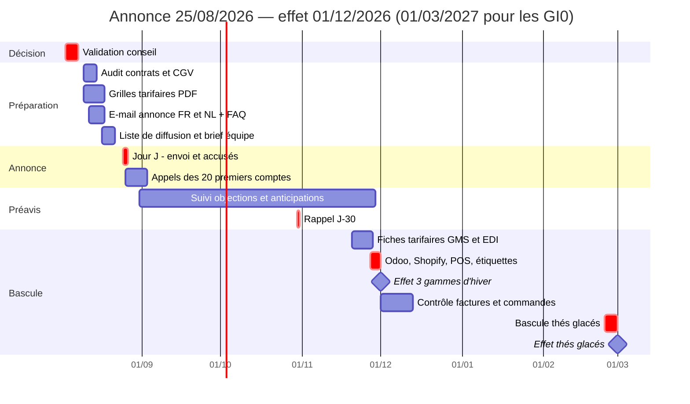

# Hausse tarifaire Teatower 2026

*Établi le 30/07/2026 sur les ventes réelles Odoo, 12 mois glissants du 30/07/2025 au 30/07/2026. Exercice social : 1er juillet → 30 juin.*

## Synthèse

| | Montant |
|---|---:|
| Base concernée, 12 mois réels | 164 394 u — 1 302 274 € HT |
| **Gain annuel en régime de croisière** | **+150 138 €** |
| dont revendeurs (GMS, B2B, Horeca) | +91 308 € |
| dont direct (boutiques, Shopify) | +58 830 € |
| Effet sur la marge brute | +15,9 % |
| Gain sur FY26-27 selon calendrier recommandé | +98 930 € |
| Perte de volume tolérable avant destruction de marge | −13,7 % |

La hausse ne coûte rien à produire : les 150 138 € tombent intégralement en marge brute. Le point de décision n'est pas *si*, mais *quand* — le calendrier vaut à lui seul une vingtaine de milliers d'euros (point 6).

**Recommandation :** annonce le **25/08/2026**, entrée en vigueur au **01/12/2026** pour les trois gammes d'hiver et au **01/03/2027** pour les thés glacés, dont la saison ne démarre qu'en avril.

## 1. Périmètre

| Gamme | Ancien | Nouveau | Hausse | SKU concernés |
|---|---|---|---:|---:|
| Doypacks vrac `V0` | 10,00 € TTC | 11,00 € TTC | +10,0 % | 99 |
| Sinfus / infusettes `I0` | 11,00 € TTC | 12,00 € TTC | +9,1 % | 90 |
| Horeca 25 env. `HC250` | 10,00 € HT | 11,00 € HT | +10,0 % | 28 |
| Thés glacés `GI0` | 9,50 € TTC | 12,00 € TTC | +26,3 % | 7 |

Les prix Odoo sont stockés **hors TVA** : à 6 %, l'échelle 9,43 / 10,38 / 11,32 € HT correspond à 10 / 11 / 12 € TTC. Seul l'Horeca est annoncé en HT. Le chiffrage ne retient que les SKU réellement au prix de référence.

À nettoyer avant toute manipulation de prix : les 9 références `GI0` à 8,50 € sont mortes (130 unités en 2025, zéro en 2026) et doivent être archivées, et `GI0917` est un doublon corrompu de `GI0916`. Les `standard_price` sont par ailleurs absents ou factices sur environ 40 % des volumes de thés glacés — les marges de cette gamme utilisent ici un coût de référence de 2,15 €.

## 2. Ce qu'on gagne aujourd'hui

| Gamme | Volumes | CA HT | Prix net moyen | Marge brute | Marge % |
|---|---:|---:|---:|---:|---:|
| Doypacks vrac `V0` | 49 419 | 411 150 | 8,32 | 309 758 | 75 % |
| Sinfus / infusettes `I0` | 62 579 | 506 689 | 8,10 | 397 113 | 78 % |
| Horeca 25 env. `HC250` | 30 021 | 234 171 | 7,80 | 135 363 | 58 % |
| Thés glacés `GI0` | 22 375 | 150 263 | 6,72 | 102 157 | 68 % |
| **Total** | **164 394** | **1 302 274** | **7,92** | **944 391** | **73 %** |

| Canal | CA HT | Gain annuel | Part du gain |
|---|---:|---:|---:|
| Boutiques TT | 409 982 | +45 325 | 30 % |
| GMS | 314 414 | +42 367 | 28 % |
| B2B revendeurs | 381 151 | +41 427 | 28 % |
| Shopify | 119 982 | +13 161 | 9 % |
| Horeca | 75 154 | +7 513 | 5 % |
| Salon / pop-up | 1 488 | +325 | 0 % |
| Amazon | 102 | +18 | 0 % |

Le prix net réalisé en GMS et en B2B tourne autour de 65 à 70 % du tarif : ce sont les conditions revendeurs, et c'est sur ce prix net que l'uplift est calculé — les remises et les promos Buy-X-Get-Y sont donc déjà intégrées.

## 3. Ce que rapporte la hausse

| Gamme | CA HT actuel | CA HT après | Gain annuel |
|---|---:|---:|---:|
| Doypacks vrac `V0` | 411 150 | 452 265 | **+41 115** |
| Sinfus / infusettes `I0` | 506 689 | 552 752 | **+46 063** |
| Horeca 25 env. `HC250` | 234 171 | 257 588 | **+23 417** |
| Thés glacés `GI0` | 150 263 | 189 806 | **+39 543** |
| **Total** | **1 302 274** | **1 452 411** | **+150 138** |

Hypothèse : grille indexée du même pourcentage sur tous les canaux, volumes constants. Aucun coût supplémentaire, donc **+150 138 € de marge brute**, soit +15,9 % sur la marge actuelle de ces gammes.

## 4. Si les revendeurs refusent

| Scénario | Gain annuel |
|---|---:|
| Répercussion intégrale, tous canaux | **+150 138** |
| Direct seul — boutiques et Shopify | +58 830 |
| Revendeurs seuls — prix consommateur gelé | +91 308 |

Les revendeurs pèsent 61 % du gain. Même s'ils refusent tous, le direct rapporte encore 58 830 € sans dépendre de personne.

## 5. Et si on perd du volume

| Perte de volume | Variation de marge brute |
|---:|---:|
| 0 % | +150 138 |
| −5 % | +95 411 |
| −10 % | +40 685 |
| −15 % | −14 042 |

Point mort global à **−13,7 %** de volume — de −10,4 % sur les Sinfus à −27,9 % sur les thés glacés. Avec 57 à 84 % de marge brute selon le canal, chaque unité perdue coûte peu au regard de ce que rapporte chaque unité vendue plus cher.

Réserve sur les thés glacés : +26 % n'est pas une indexation mais un repositionnement. Un acheteur GMS ne réduit pas ses volumes de 26 %, il accepte ou il déréférence — et la GMS pèse 56 % de cette gamme. À 12 € le thé glacé passe aussi devant le doypack à 11 € alors que le seul grammage renseigné est de 50 g contre 80 à 100 g : **le grammage réel doit être vérifié sur l'emballage** avant de trancher entre 12 € et 11 € (+23 726 € au lieu de +39 543 €).

## 6. Le calendrier vaut de l'argent

| Poids du CA par mois | Jan | Fév | Mar | Avr | Mai | Juin | Juil | Août | Sep | Oct | Nov | Déc |
|---|---|---|---|---|---|---|---|---|---|---|---|---|
| 3 gammes d'hiver | 12 % | 10 % | 11 % | 9 % | 9 % | 8 % | 6 % | 3 % | 5 % | 9 % | 9 % | 10 % |
| Thés glacés | 1 % | 2 % | 3 % | 7 % | 16 % | 34 % | 24 % | 6 % | 4 % | 1 % | 1 % | 1 % |

Les saisonnalités sont **opposées**. Les trois gammes d'hiver font 60 % de leur CA d'octobre à mars, avec un pic en janvier ; les thés glacés font 87 % du leur d'avril à août, avec un pic en juin.

| Entrée en vigueur | Gain FY26-27 |
|---|---:|
| 3 gammes au 01/11/2026 *(annonce 01/08, intenable)* | +85 048 |
| **3 gammes au 01/12/2026** *(annonce 25/08, recommandé)* | **+74 927** |
| 3 gammes au 01/01/2027 *(annonce 01/10)* | +63 475 |
| **Thés glacés au 01/03/2027** *(6 mois de préavis)* | **+24 003** |
| Thés glacés au 01/12/2026 *(3 mois de préavis)* | +25 320 |

Deux conséquences. Sur les gammes d'hiver, un préavis annoncé fin août se consomme entièrement dans le creux estival et le tarif mord au démarrage de la saison forte ; chaque mois de report coûte ensuite 11 452 € environ, prélevés sur un gros mois.

Sur les thés glacés c'est l'inverse : la saison 2026 est passée et la suivante ne démarre qu'en avril, donc **accorder six mois de préavis au lieu de trois ne coûte que 1 317 €**. C'est le levier de négociation du dossier — on donne le double du préavis légal sur la hausse la plus rude, presque gratuitement.

## 7. Option : indexer toute la gamme

Le chiffrage ci-dessus ne porte que sur les SKU au prix de référence. Indexer aussi les autres formats et séries limitées des gammes `V0`, `I0` et `HC250` rapporterait **+18 892 € de plus par an**. À trancher : ces références ont déjà des prix non ronds, une indexation les rendrait encore moins lisibles en rayon.

## 8. Plan de déploiement

Responsables : **Nicolas** pour les grilles, l'audit contractuel et la bascule système ; **Stephan** pour l'e-mail d'annonce et le rappel J-30 ; **Jérôme** pour la FAQ et les appels grands comptes ; **Vanessa** pour le contrôle des prix sur les commandes et factures ; **Gilles** pour les étiquettes en boutique.

Trois pièges de bascule : Shopify est en `taxes_included`, il faut y pousser **11,00 et 12,00 TTC** et jamais le HT ; les fiches tarifaires GMS partent **avant** la bascule Odoo sous peine de rejet EDI ; les promos B2C restent en Buy-X-Get-Y, jamais en pourcentage.
